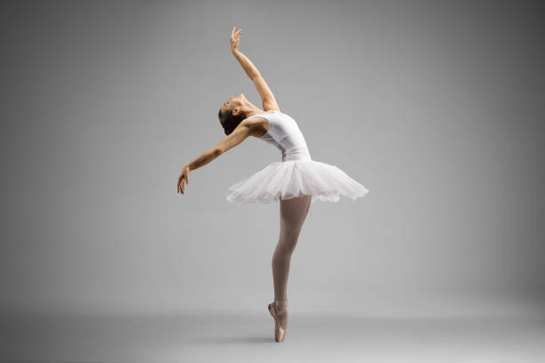
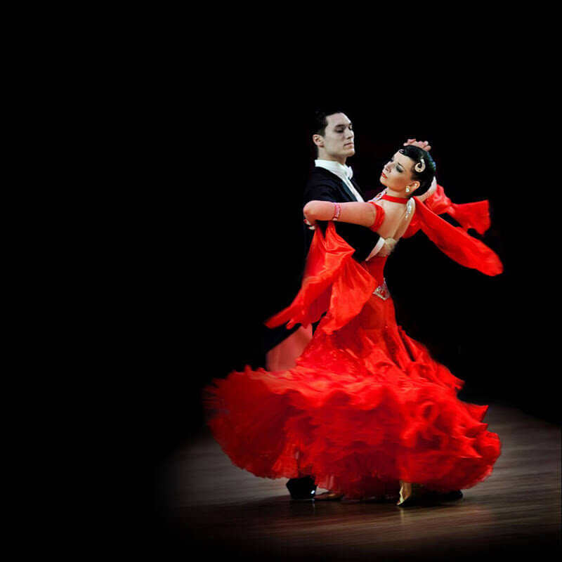

[index.html](https://github.com/user-attachments/files/28219659/index.html)
<!DOCTYPE html>
<html lang="ru">
<head>
    <meta charset="UTF-8">
    <title>Мир Танца - Часть 1</title>
    
</head>
<body>

    <header>
        <h1>Энциклопедия Танца</h1>
        
Путешествие в мир ритма и движения

    </header>

    <nav>
        <a href="index.html">Главная страница</a>
        <a href="page2.html">Продолжение (Стр. 2)</a>
    </nav>

    

        <!-- Карточка 1 -->
        

            
            

                <h2>Балет</h2>
                
Классический танец, зародившийся в Италии эпохи Возрождения. Характеризуется легкостью, точностью движений и особой техникой (например, пуанты). Это высшая форма сценического танца.

            

        

        <!-- Карточка 2 -->
        

            
            

                <h2>Хип-хоп</h2>
                
Уличное направление, возникшее в Нью-Йорке в 70-х годах. Это не просто танец, а целая культура, включающая музыку, одежду и сленг. Движения часто резкие, ритмичные и свободные.

            

        

        <!-- Карточка 3 -->
        

            
            

                <h2>Танго</h2>
                
Страстный парный танец родом из Аргентины. Это диалог между мужчиной и женщиной, полный драматизма, пауз и резких движений. Часто исполняется под музыку бандонеона.

            

        

        <!-- Карточка 4 -->
        

            
            

                <h2>Сальса</h2>
                
Парный социальный танец латиноамериканского происхождения. Очень энергичный, веселый и ритмичный. Основа — работа бедер и быстрая смена позиций партнеров.

            

        

    

    <footer>
        
© 2026 Мой журнал о танцах Анастасия Злыднина

    </footer>

</body>
</html>
